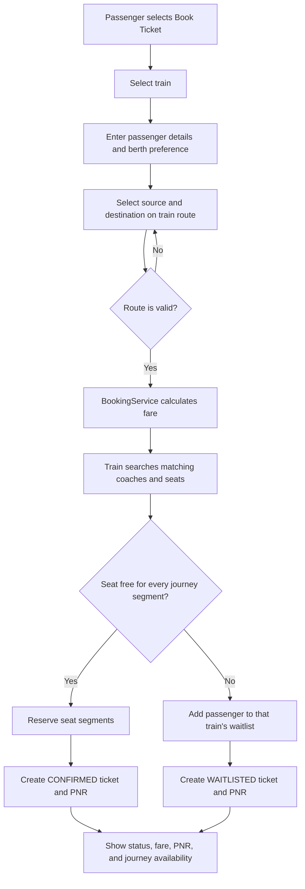
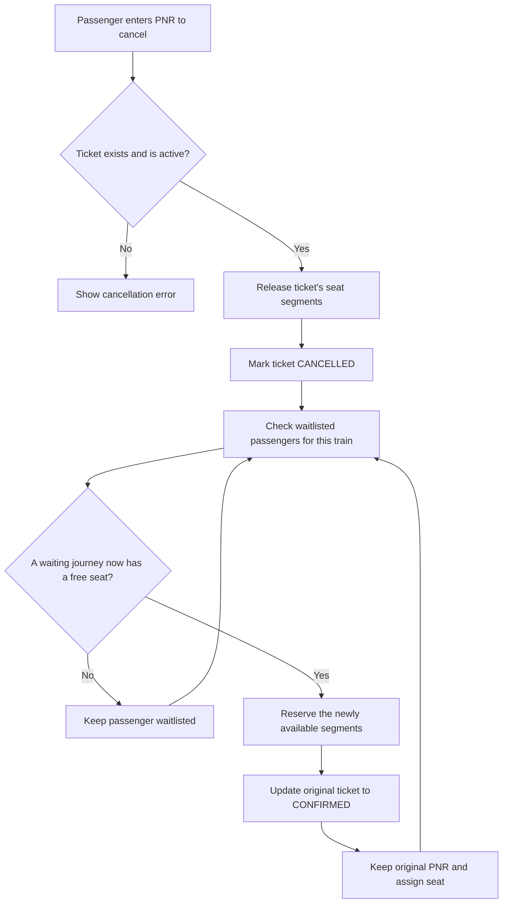
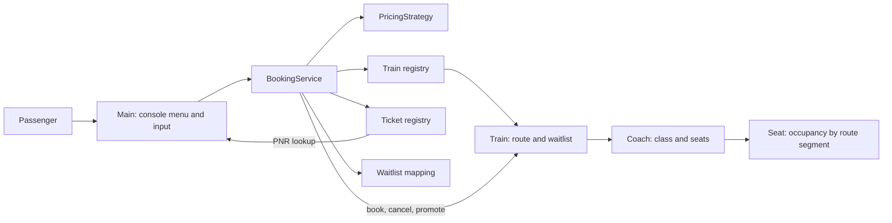

# Railway Ticket Management System

A Java console application for booking and managing railway tickets. Passengers can select a train and route, request a berth preference, receive a confirmed or waitlisted booking, check a ticket by PNR, and cancel a booking.

The sample network has four independent train services between New Delhi, Kanpur Central, and Howrah Junction:

| Train | Direction | Class | Seats |
| --- | --- | --- | ---: |
| 12302 - Howrah Rajdhani Express | New Delhi -> Kanpur Central -> Howrah Junction | Third AC | 3 |
| 12304 - Howrah Mail | New Delhi -> Kanpur Central -> Howrah Junction | Third AC | 3 |
| 12301 - New Delhi Rajdhani Express | Howrah Junction -> Kanpur Central -> New Delhi | Third AC | 3 |
| 12303 - New Delhi Mail | Howrah Junction -> Kanpur Central -> New Delhi | Third AC | 3 |

## Features

- Interactive terminal menu for booking, cancellation, ticket lookup, and exit.
- Separate seat inventory and waitlist for each train.
- Segment-based seat allocation: the same seat can serve consecutive journeys that do not overlap, such as Howrah -> Kanpur and Kanpur -> New Delhi.
- Berth preference matching with fallback to another available berth.
- Fare calculation based on journey distance and class multiplier.
- Waitlisted passengers can be promoted when a cancellation frees all the segments they need; promotion retains the original PNR.
- Displays remaining seats for the booked train and journey.

## Requirements

- JDK 17 or later
- VS Code is optional

## Run from a terminal

From the project root, compile all Java source files and launch the application:

```powershell
$sources = Get-ChildItem -Path src -Recurse -Filter '*.java' | ForEach-Object { $_.FullName }
javac -d out $sources
java -cp out com.railway.Main
```

The generated `out` directory and `.class` files are ignored by Git.

In VS Code, open the project root folder. You can run with **F5** using the Java launch configuration or use the Code Runner **Run Code** button; both launch the interactive program in the integrated terminal.

## Booking flow



## Cancellation and waitlist promotion



## Architecture



## Fare calculation

The sample standard pricing strategy calculates:

```text
fare = absolute distance in km * 1.25 * seat-class multiplier
```

For example, New Delhi -> Howrah is 1,450 km. Third AC uses a multiplier of 1.1, giving a fare of INR 1,993.75.

## Current scope and limitations

- Train names, routes, classes, and seat counts are configured in `Main.java`.
- Passenger and booking information are entered at runtime.
- Tickets, seat occupancy, and waitlists are held in memory and reset when the application exits.
- The console currently books one passenger per booking.
- This is a learning/demo project, not a live railway reservation or payment service.
