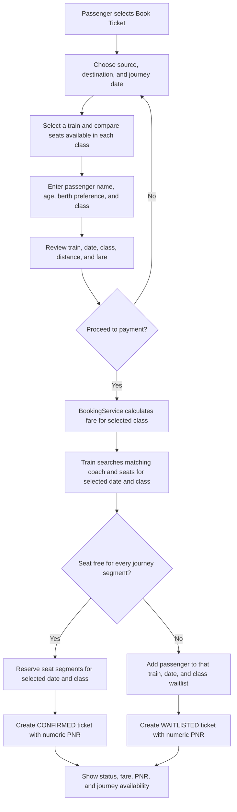
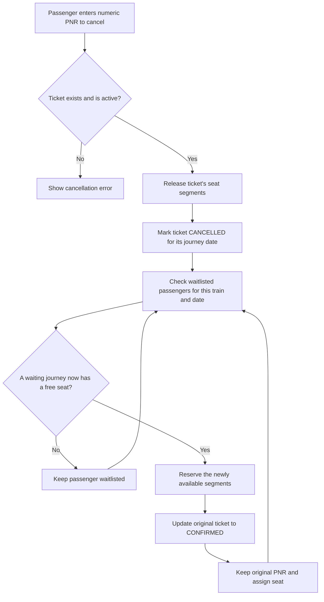
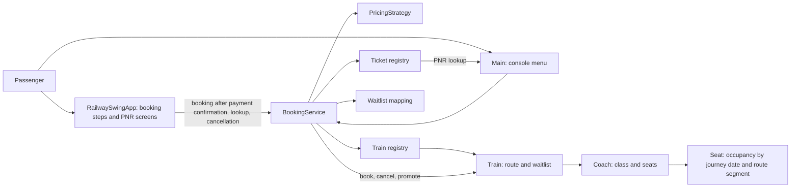

# Railway Ticket Management System

A Java railway ticket application with a Swing desktop interface and a console alternative. Passengers can select a train and route, request a berth preference, receive a confirmed or waitlisted booking, check a ticket by PNR, and cancel a booking.

The sample network has four independent train services between New Delhi, Kanpur Central, and Howrah Junction:

| Train | Direction | Sample departure | Available classes | Seats per class |
| --- | --- | --- | --- | ---: |
| 12302 - Howrah Rajdhani Express | New Delhi -> Kanpur Central -> Howrah Junction | 16:55 | First AC, Second AC, Third AC, Sleeper, General | 3 |
| 12304 - Howrah Mail | New Delhi -> Kanpur Central -> Howrah Junction | 19:30 | First AC, Second AC, Third AC, Sleeper, General | 3 |
| 12301 - New Delhi Rajdhani Express | Howrah Junction -> Kanpur Central -> New Delhi | 17:10 | First AC, Second AC, Third AC, Sleeper, General | 3 |
| 12303 - New Delhi Mail | Howrah Junction -> Kanpur Central -> New Delhi | 21:00 | First AC, Second AC, Third AC, Sleeper, General | 3 |

## Features

- Swing desktop booking flow: route/date search, available-train selection with seat counts for each class, passenger details including class, review with distance and fare, and payment confirmation.
- View availability for First AC, Second AC, Third AC, Sleeper, and General on each train; select the class in the passenger details form and see its date-specific seat/waitlist count.
- Swing ticket lookup and cancellation by numeric PNR; ticket details include train number and name, journey date, and distance.
- Interactive terminal menu remains available for booking, cancellation, ticket lookup, and exit.
- Separate seat inventory and waitlist for each train and journey date.
- Segment-based seat allocation: the same seat can serve consecutive journeys that do not overlap, such as Howrah -> Kanpur and Kanpur -> New Delhi.
- Berth preference matching with fallback to another available berth.
- Berth preferences are requests only and are subject to availability; another berth may be assigned.
- Fare calculation based on journey distance and class multiplier.
- Waitlisted passengers can be promoted when a cancellation frees all the segments they need; promotion retains the original PNR.
- Cancellation charge: 10% at least 48 hours before departure; 25% from 24 to under 48 hours; 100% under 24 hours. Cancellation is closed at or after departure.
- Cancellation confirmation shows the scheduled departure, remaining time, cancellation charge, and refund amount before confirming.
- The sample departure times are illustrative. Cancellation charges and refunds are calculated and shown in-app; there is no live payment/refund gateway, so no money is transferred.
- Displays remaining seats for the booked train and journey.

## Requirements

- JDK 17 or later
- VS Code is optional

## Run the Swing interface

From the project root, compile the Java source files and launch the desktop interface:

```powershell
$sources = Get-ChildItem -Path src -Recurse -Filter '*.java' | ForEach-Object { $_.FullName }
javac -d out $sources
java -cp out com.railway.RailwaySwingApp
```

To use the original console menu instead, run:

```powershell
java -cp out com.railway.Main
```

The generated `out` directory and `.class` files are ignored by Git. In VS Code, **F5** launches the Swing interface; choose the console configuration to run the terminal menu.

## Booking flow



## Cancellation and waitlist promotion



## Architecture



## Fare calculation

The sample standard pricing strategy calculates:

```text
fare = absolute distance in km * 1.25 * seat-class multiplier
```

For example, New Delhi -> Howrah is 1,450 km. Third AC uses a multiplier of 1.1, giving a fare of INR 1,993.75.

## Current scope and limitations

- Train names, routes, classes, and seat counts are configured in `Main.java`.
- Passenger and booking information are entered at runtime.
- Tickets, seat occupancy, and waitlists are held in memory and reset when the application exits.
- The console currently books one passenger per booking on the current date. Swing payment confirmation and cancellation refunds are calculations only and are not connected to an external payment provider.
- This is a learning/demo project, not a live railway reservation or payment service.
